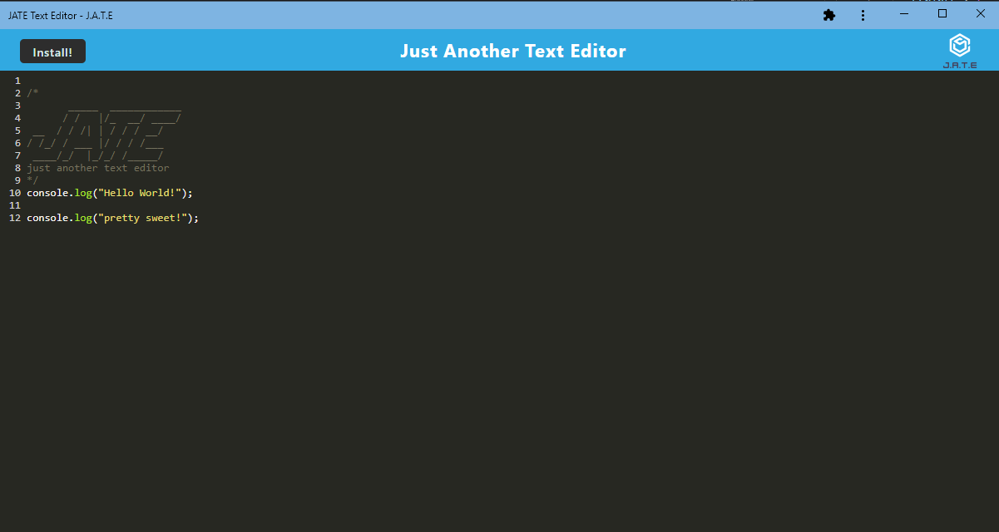

# J.A.T.E Text Editor using Progressive Web Applications (PWA)

## Your Task

The task for this project is to build a text editor that runs in the browser. The app will be a single-page application that meets the PWA criteria. Additionally, it will feature a number of data persistence techniques that serve as redundancy in case one of the options is not supported by the browser. The application will also function offline.

IndexedDB database is being used for storing data and a package called `idb`, which is a lightweight wrapper around the IndexedDB API, is used as well. 

## User Story

```md
AS A developer
I WANT to create notes or code snippets with or without an internet connection
SO THAT I can reliably retrieve them for later use
```

## Acceptance Criteria

```md
GIVEN a text editor web application
WHEN I open my application in my editor
THEN I should see a client server folder structure
WHEN I run `npm run start` from the root directory
THEN I find that my application should start up the backend and serve the client
WHEN I run the text editor application from my terminal
THEN I find that my JavaScript files have been bundled using webpack
WHEN I run my webpack plugins
THEN I find that I have a generated HTML file, service worker, and a manifest file
WHEN I use next-gen JavaScript in my application
THEN I find that the text editor still functions in the browser without errors
WHEN I open the text editor
THEN I find that IndexedDB has immediately created a database storage
WHEN I enter content and subsequently click off of the DOM window
THEN I find that the content in the text editor has been saved with IndexedDB
WHEN I reopen the text editor after closing it
THEN I find that the content in the text editor has been retrieved from our IndexedDB
WHEN I click on the Install button
THEN I download my web application as an icon on my desktop
WHEN I load my web application
THEN I should have a registered service worker using workbox
WHEN I register a service worker
THEN I should have my static assets pre cached upon loading along with subsequent pages and static assets
WHEN I deploy to Heroku
THEN I should have proper build scripts for a webpack application
```

## Description

* A link to deployed application(Heroku): https://warm-peak-56584.herokuapp.com/

* How to Use:
  * This page is a progressive web application and can be installed to user's pc. Click install button on the page or button next url to install the application.
    
  * The content of editor will be saved when it losts its focus. In other words, while text cursor is blinking, editor is still editing the text. To save text content, click outside of editor so the text cursor isn't blinking. 
  * Editor can be used online and offline.
  * Empty Text Editor will be automatically filled with following header:
  ```
  /*
         _____  ____________
        / /   |/_  __/ ____/
  __   / / /| | / / / __/   
  / /_/ / ___ |/ / / /___   
   ____/_/  |_/_/ /_____/   
  just another text editor
  */ 
  ```

## Credits
* npm packages:
  * [webpack](https://www.npmjs.com/package/webpack), [idb](https://www.npmjs.com/package/idb), [babel-loader](https://www.npmjs.com/package/babel-loader), [css-loader](https://www.npmjs.com/package/css-loader), [html-webpack-plugin](https://www.npmjs.com/package/html-webpack-plugin), [http-server](https://www.npmjs.com/package/http-server)


- - -
© 2023 edX Boot Camps LLC. Confidential and Proprietary. All Rights Reserved.
# JATE_Text_Editor
